#  Godot Project Builder

Project Builder is an automation tool made in Godot Engine and focused on exporting and publishing Godot projects. The builder works by running "routines", which are composed of "tasks". Each task involves running a predefined command with customized arguments. The builder comes with numberous built-in tasks, which include exporting project, publishing to popular stores (Steam, GOG, Epic, itch.io), and file operations. Task setup is fully visual.

Running the tool from source requires at least Godot 4.3. You can pick an executable from the official releases. Project Builder can be used with projects from older Godot versions, including Godot 3.

## Overview

Project Builder can be launched from a release executable or from source, using Godot Engine. When you start Project Builder, the first thing you will see is the project list.

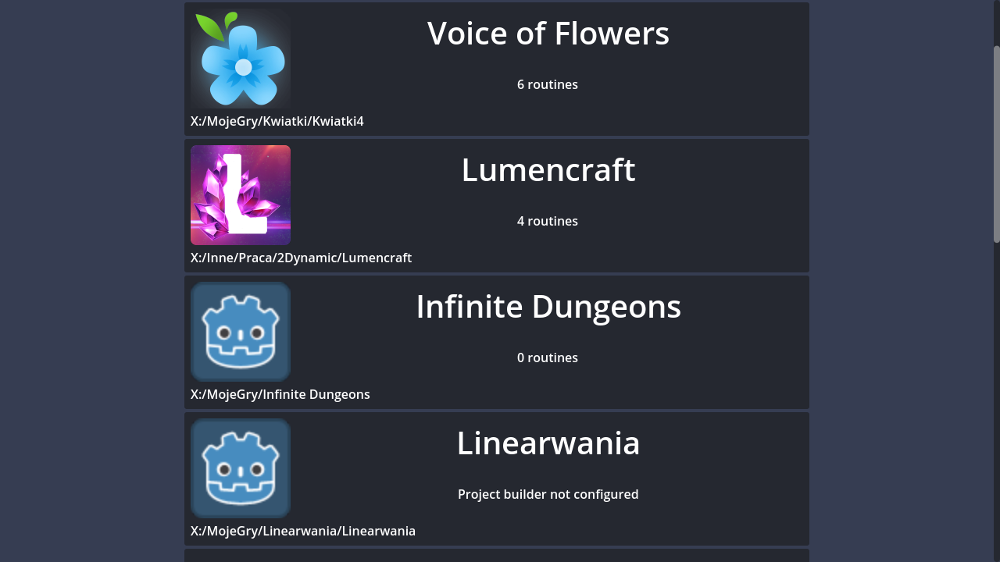

It's similar to Godot's own Project Manager, but more minimal. It automatically lists the projects you have registered in Godot, with information whether Project Builder is configured for that project and how many routines it has. Clicking a project will open the main project view.

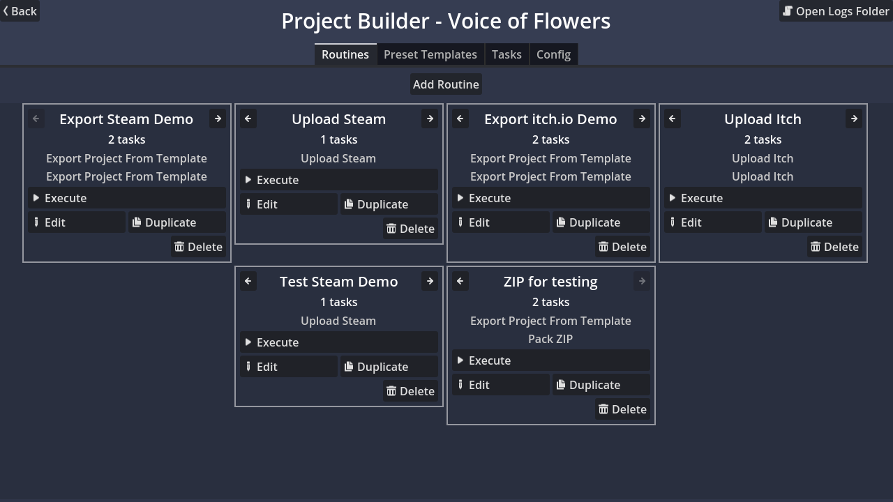

It shows projects title at the top and is divided into 4 tabs: Routines, Templates, Tasks and Config. They are explained below.

### Routines

This tab shows overview of all routines in your project. You can create a routine by clicking Add Routine button, which will add an empty one:

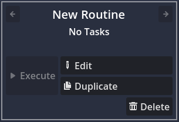

From the main view, routines can be executed, edited, duplicated or deleted. When you create and edit a routine, it will be automatically saved in a dedicated project build configuration file stored in your project's folder. By default the file is located at `res://project_builds_config.txt`. When a routine has tasks, it will show a brief list.

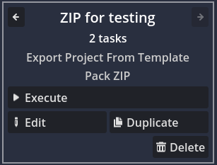

#### Editing Routines

By clicking the Edit button in a routine, you will open an editing screen where you can assign tasks to a routine.

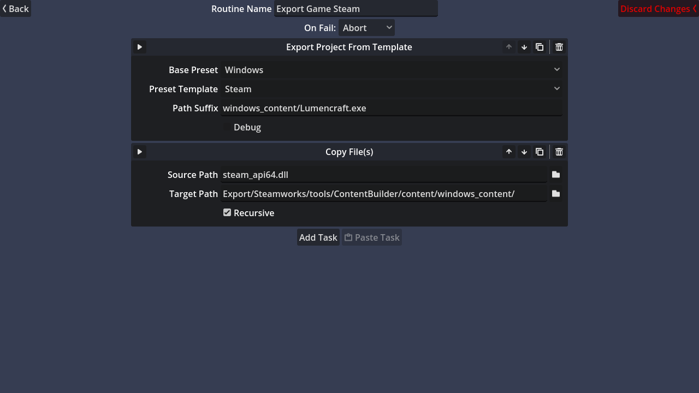

On this screen you'll see a list of all tasks assigned to the routine. You can add a task by clicking Add Task button and selecting a task from the list.

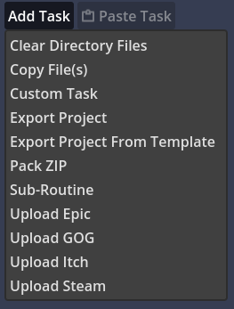

After the task is added, you can use its controls to setup it. Reference about task usages and its configuration is available in the [Tasks](#tasks) tab or in the [task list](#list-of-available-tasks) in this README.

At the top of the task preview is its title and various buttons. The top-left button allows you to quickly execute a single task from the routine (see [Executing](#executing)). The top-right has buttons for rearranging tasks, a Copy button and a Delete button. Copy will copy the task data into an internal clipboard and you will be able to paste the task into the same routine, other routines, or even other projects. The Delete button requires double-click to activate, to prevent accidental deleting. A deleted task cannot be recovered, as currently the Project Builder does not support undo/redo.

Above the task list is the routine name field, where you can rename it. Note that each routine needs an unique name and if there is a conflict, you won't be able to leave this screen (unless you use the Discard Changes button). Aside from name, there is a dropdown for controlling what happens when a task fails (see [Executing](#executing)). Clicking Back will go back to the main screen and save the routine. The routine is also saved when you close the Project Builder.

#### Executing

By clicking the Execute button in a routine or using using the quick-execute button in routine editing screen, you will enter the execution mode. If you did this by accident, you have 2 seconds (default) to press Escape and cancel task (afterwards you have to close the application if you want to stop it). The initial delay can be configured in Global Config.

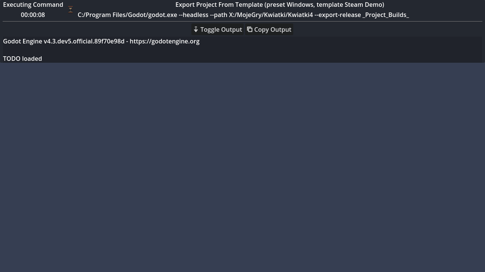

Execution works simply by running tasks one after another. A task will run a command with arguments and display the output in real time. Once a task finishes, you will see whether it succeeded or failed, its exit code, and the time it took to execute.

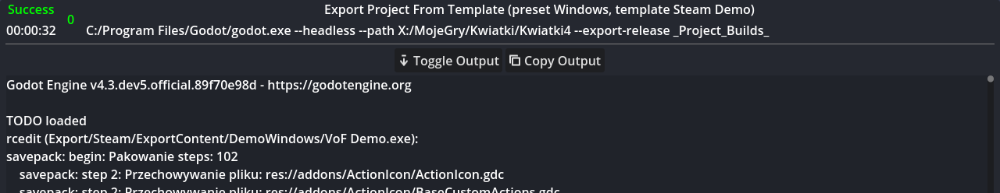

Top of the task is its execution name (i.e. a more detailed task name) and the exact command that is executed when the task runs (in the example above, the task invoked Godot with `--export-release`). Clicking that command will copy it to the clipboard (so you can e.g. paste it into terminal, edit and run manually). Below is Toggle Output button that allows you to hide output and Copy Output, which will copy it to the clipboard. Output is also written to log files that can be accessed from Open Log Folder on the project's main screen.

Normally when a task fails, the whole execution will stop. You can configure that in routine settings; the other option is to continue executing normally. When a routine finishes, you will see the total time it took to execute.

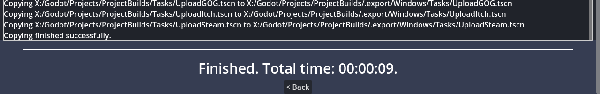

The routine may also fail before it starts running. This can happen when some tasks have prevalidation step, i.e. they check prematurely if their configuration is invalid and guaranteed to fail the task. E.g. Upload Steam task will fail if you didn't provide Steam CMD path.

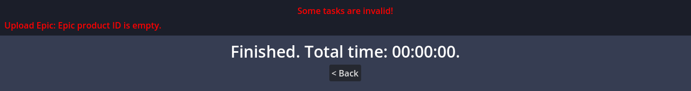

### Preset Templates

The second tab in the main screen. It allows defining templates for export presets. It's a way to share properties like file filters or feature tags between mutliple presets, making multiple export targets easier to manage.

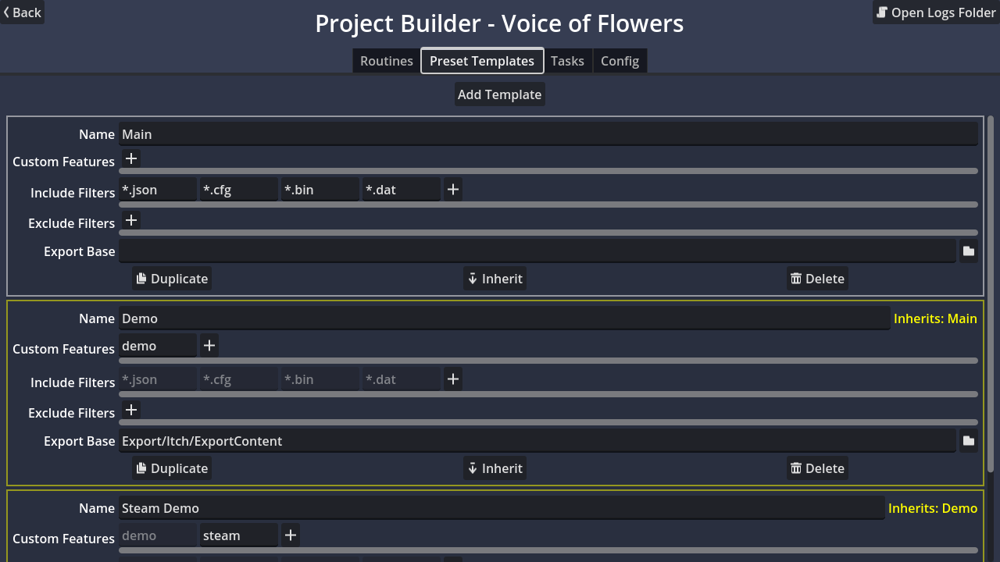

A template is composed of Name, Custom Features, Include Filters, Exclude Filters and Export Base. Name has to be unique; in case of conflict, duplicate templates will be ignored. Custom Features are equivalent of the custom features in Features tab of export dialog, while Filters are equivalent of Include/Exclude Filters in Resources tab. Images for reference:

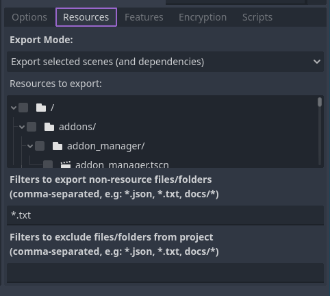 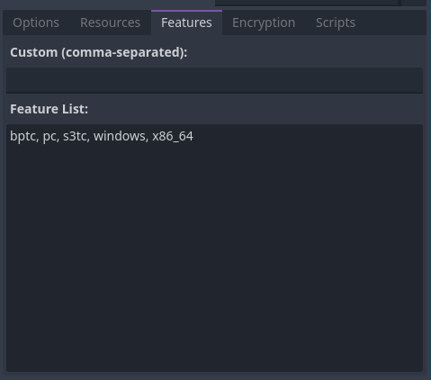

Export Base is a base directory used when exporting with this template. It's later prefixed with the actual file (see [Export Project From Template](#export-project-from-template)).

Templates can inherit other templates. Inheriting template will include features and filters of the parent and auto-update them, so you can e.g. make one configuration with your include filters and make all other templates use it. You no longer have to worry about updating all export presets when you add a new file extension. Export Base is not inherited.

### Tasks

The third tab in the main screen. It's a readonly list of all available tasks, with their descriptions and argument list. You can use it as a quick reference of what does what. More detailed information is available in this README at [List of Available Tasks](#list-of-available-tasks).

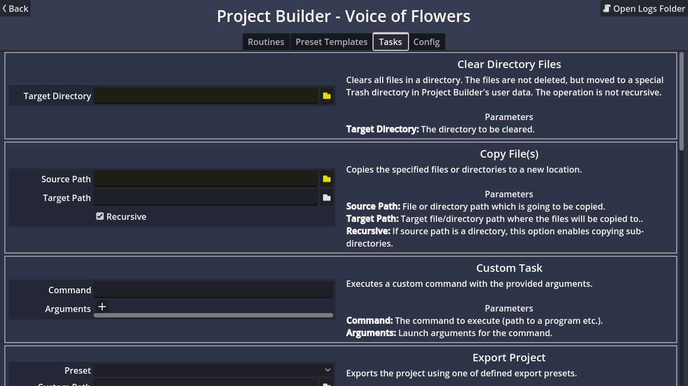

The tasks are listed from the Tasks directory of Project Builder. Each task is a separate scene with the root inheriting a special Task class, which extends Control. All configuration controls are part of the task scene.

#### Custom Tasks

You can create your own tasks by adding new scenes to the Tasks folder. The easiest way to create a Task is by opening the Project Builder source project and creating a new scene using Task class for root. There is a script template that makes it easier.

When implementing methods, refer to the documentation of Task class and the existing tasks implementation (the default tasks have their code in built-in scripts). If you are using a stand-alone version of the Project Builder, you'll have to copy your new task to the Tasks folder of your installation. In the future there might be support for project local tasks, but currently this feature is not a priority.

### Config

The last tab in the main screen. Here you can configure Project Builder. It includes both global config that applies to all your projects and a local config, which is per-project. The local config is stored in the builds config file mentioned before, while global config is stored in Project Builder's user data folder.

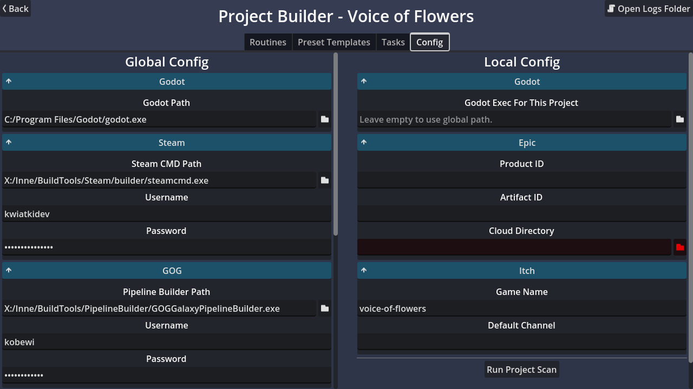

Both configurations are also organized into foldable tabs of related settings.

#### Global Configuration

- **Godot**
    - **Godot Path:** Path to the Godot executable. It will be used for exporting projects.

- **Steam**
    - **Steam CMD Path:** Path to `steamcmd.exe` that comes with Steam SDK. It's needed if you want to publish builds to Steam.
    - **Username:** Login used for authentication when uploading games. Note that Project Builder does not support console input, so you can't use account that uses Steam mobile app for authentication (it requires inputting a code with each login). E-mail 2FA only requires single authentication, which you can do externally.
    - **Password:** Password for the above account. Project Builder will automatically hide password when executing a command, but while the password is not stored in the project folder, it can be found in the global configuration file of Project Builder.

- **GOG**
    - **Pipeline Builder Path:** Path to Pipeline Builder executable used to publish builds to GOG.
    - **Username:** Used for authentication when uploading games, just like in Steam.
    - **Password:** Password for the above account.

- **Epic**
    - **Build Patch Tool Path:** Path to Build Patch Tool executable used to publish builds to Epic Games.
    - **Organization ID**, **Client ID:** The organization and client ID provided for your developer account.
    - **Client Secret:** The client secret provided for your developer account. This is a sensitive data, like the Steam and GOG passwords.
    - **Client Secret Env Variable:** Name of the environment variable that contains your Client Secret. This is an alternate authentication method supported by Build Patch Tool and it will be used instead of Client Secret if provided.

- **Itch**
    - **Butler Path:** Path to itch.io's Butler executable used to publish builds to itch.io.
    - **Username:** Login used for authentication when uploading games. Note that unlike the other upload tools, you have to launch butler and login to cache your credentials (this is not handled by Project Builder). It has to be done once.

#### Local Configuration

- **Godot**
    - **Project Builder Configuration Path:** Path to Project Builder configuration file (by default `project_builds_config.txt`). You need to press Apply button to actually change this setting. Doing so will also automatically move the file. Unlike other local settings, this one is stored in `project.godot`, under hidden `_project_builder_config_path` setting. Note that in Local Config the path is not editable and you can change only the directory. Manually changing the path is not advised.
    - **Godot Exec For This Project:** Executable used for exporting the current project. If you leave this empty, the default one will be used. This option is useful when you have projects using different Godot versions.

- **Epic**
    - **Product ID**, **Artifact ID:** Product and artifact IDs provided for your game.
    - **Cloud Directory:** Directory required by Build Patch Tool for its operation. It's effectively a cache directory, so you can add it to your VCS ignore list.

- **Itch**
    - **Game Name:** Name of your game. This has to match the itch.io page (e.g. if your game is at `username.itch.io/my_game`, Game Name should be `my_game`).
    - **Default Channel:** App channel to which the game will be uploaded if not specified by the task.
    - **Version File:** File to use for `userversion-file` argument. If not provided, the argument will not be passed. If "Use Project Version" is enabled in upload task, the file is ignored.

#### Project Scan

At the bottom of the Config tab is a Run Project Scan button. It launches a scan of all files in your project. This is required by some tasks and will run automatically when the project is opened for the first time. If a task is relying on scan results (as noted [in its description](#list-of-available-tasks)), you may want to run the scan if the data is outdated. It has to be done manually, for performance reasons (crawling every file in the project can be expensive).

#### Required Paths

This applies to tasks and configuration. You will sometimes notice that a file/directory field is marked yellow or red. This denotes required fields. If a field is yellow, it means that the target file/directory must exist at the time the task is executed, so at most it has to be created as a result of preceding tasks. If a field is red it means that the task will fail at the prevalidation stage.

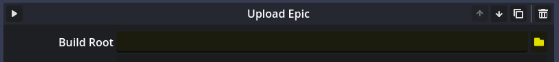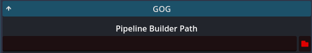

### Project Builder Plugin

Project Builder has an optional plugin that allows for better integration with your project. Using the plugin you can change the location of your project's build config file and run Project Builder directly for your project. At the bottom of the Config tab you can find the plugin status in your project:

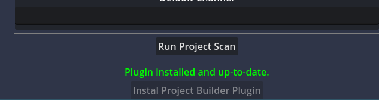

It will tell you whether the plugin is installed or not, and if it needs update. If the plugin is not installed or outdated, you can click Install Project Builder Plugin to add the plugin to your project (you'll need to manually enable it in Project Settings).

The addon also adds a Project Builder submenu to Project -> Tools menu. From there you can run Project Builder or directly execute any of the registered routines. These options are also added to Command Palette under Project Builder category.

### Running From Command Line

While Project Builder has a visual execution mode, you can use it as a tool for configuring automated tasks and run them from command line. Project Builder supports a number of command line arguments. You need to pass them after `--` in your command. These arguments are:
- `--open-project <project>`: Starts Project Builder and opens the provided `project`.
- `--execute-routine <routine>`: On launch, executes the routine `routine`.
- `--exit`: If executing routine, automatically exits after finishing or error.

Example line for running builder for project at `C:/My Project` in headless mode, executing routine `Export Game` and exiting:
```
godot --path "C:/Project Builder" -- --open-project "C:/My Project" --execute_routine "Export Game" --exit
```
The `--path` part can be omitted when running from Project Builder installation directory.


## List of Available Tasks

This sections lists all default tasks shipped with Project Builder.

### Clear Directory Files

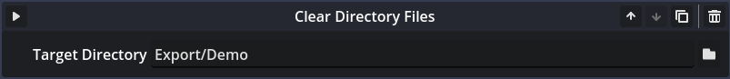

Removes all files in a directory. The files are not deleted permanently, instead they are moved to a dedicated `Trash` directory in Project Builder's user data. If you used this task accidentally or want to recover files, you can find them in that directory. Note that Trash holds only one copy of the file, so if you "delete" it again, it will be overwritten.

This task is useful for preparing export directory, to make sure that it doesn't have lefotver files.

**Options**
- **Target Directory:** The directory in your project that's going to be cleaned.

### Copy Files(s)

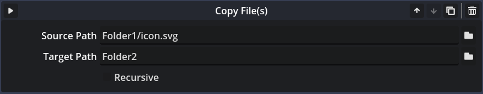

Copies a file or directory from source path to destination. It can also recursively copy whole directory. If files already exist at the target location, they will be overwritten. If the target directory does not exist, it will be created.

Useful for copying additional files not included with export.

**Options**
- **Source Path:** The source path to copy. If a file is selected, only this file will be copied. If a directory is selected, all files will be copied to the target location.
- **Target Path:** The destination where the files will be copied. If source is a file and target is a directory, the file will be copied to the directory and keep its name. If target is a file, the file will be copied and renamed to the new name. If source is a directory, all files will be copied to the target directory.
- **Recursive:** When copying directory, this option enables copying sub-directories.

### Custom Task


An arbitrary task for operations not covered by other tasks, to use when it's not worth it to make a new task type. The task allows to specify a raw command and argument list that will be invoked during execution. It's very flexible, but requires manually providing all necessary data.

Note that working directory is undefined, so you should use absolute paths both for command and arguments. You can use `$project` placeholder, which will be automatically substituted with path to the current project, e.g. `$project/.godot`.

**Options**
- **Command:** Command that will be executed. It will be invoked like from a terminal. You can use `$godot` or `$local_godot` special names to use current Godot executable or project-configured Godot executable respectively.
- **Arguments:** List of arguments provided for the command. They are automatically wrapped in quotes when necessary.

### Export Project

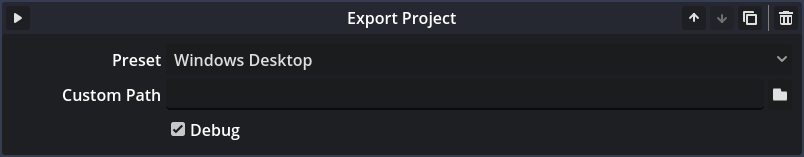

Exports the project using the given preset (it will list the presets defined in `export_presets.cfg`). Also allows to provide custom export path. If the target directory does not exist, it will be automatically created. This task uses the Godot executable specified in [config](#config). If you are exporting a Godot 3 project, make sure to provide a Godot 3 executable.

**Options**
- **Preset:** Export preset used to export the project.
- **Custom Path:** If provided, the preset's path will be overriden. If empty, the default path will be used.
- **Debug:** Determines whether debug or release build is exported.

### Export Project From Template

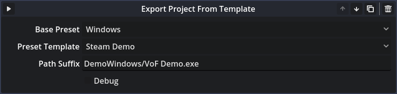

Exports the project using the given base preset and [preset template](#preset-templates). It works by temporarily adding a new preset to `export_presets.cfg` file. The new preset will be a copy of the base preset with some properties modified based on the template.

**Options**
- **Base Preset:** Base export preset from the project's preset list.
- **Preset Template:** The template from the list of templates defined in Project Builder.
- **Path Suffix:** Partial path that will be joined with Export Base property of the [template](#preset-templates). E.g. you can set the base path to `Export/Steam` and then you can specify suffix based on platform, like `Windows/MyGame.exe` (suffix has to include the file name). If Export Base was not defined, the default path from export preset will be used.
- **Debug:** Determines whether debug or release build is exported.

### Pack ZIP

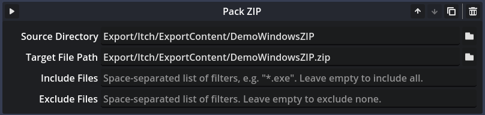

Packs the given directory (including subfolders) to a ZIP archive. You can specify include and exclude filters for files, which work using globbing. You can define both include and exclude filters and they will be both evaluated for each file.

Useful when you want to pack an exported project to share it. The ZIP is created using Godot's ZIPPacker class.

**Options**
- **Source Directory:** The directory which is going to be packed. The ZIP will have the same structure.
- **Target File Path:** The path to the resulting ZIP file.
- **Include Filters:** Filters applied to each processed file to determine whether it should be included. Use it when you want to pack only some files of the directory. If empty, files will be included by default.
- **Exclude Filters:** Filters applied to each processed file to determine whether it should be excluded. Use it when your directory has files that shouldn't be packed. If empty, no file will be excluded by default.

### Sub-Routine

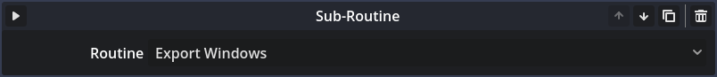

Includes another routine as a task. The other routine's tasks will be seamlessly added to the execution list. This is useful when you e.g. have export and upload in separate routines, but want one that does everything.

**Options**
- **Routine:** The routine that will be processed by this task, from the list of routines defined in your project.

### Upload Epic

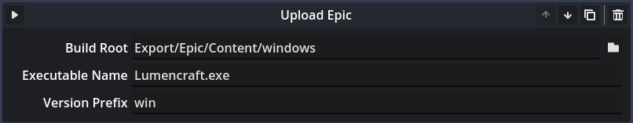

Uploads files to Epic Games using Build Patch Tool. Uploading to Epic requires executing a lengthy command, so this task is especially helpful in getting it right. Before using it you need to fill Epic sections in your global and local configs.

This task uses the project's version, which is read from `application/config/version` Project Setting of your project. Make sure it's unique for each upload. You can use [my auto versioning addon](https://github.com/KoBeWi/Godot-Auto-Export-Version) to handle that easily ;) Note that Epic imposes some limits on the version string (related to available characters and length). Refer to the [Build Patch Tool manual](https://dev.epicgames.com/docs/epic-games-store/publishing-tools/uploading-binaries/bpt-instructions-150#how-to-upload-a-binary) for details, but unless you use crazy version strings, you won't run into a problem.

**Options**
- **Build Root:** The root directory of the files you want to upload.
- **Executable Name:** The executable file used for launching the application (relative to the root directory).
- **Version Prefix:** String prefixed to your project's version. Epic requires each upload to have unique version, so you can define a per-platform prefix for each task. It will be appended to your project version with a dash, e.g. if your project has version `1.0` and prefix is `win`, the uploaded version will be `1.0-win`.

### Upload GOG

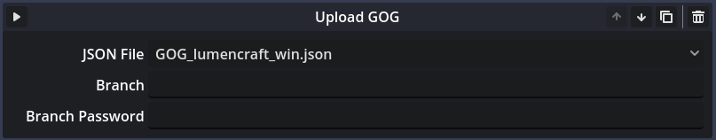

Uploads files to GOG using Pipeline Builder. This task has no configuration in itself, you only pick the GOG's JSON configuration file that will be used. Make sure to fill the GOG global configuration before using this task. Like Upload Epic, this task uses project's version.

**Options**
- **JSON File:** The JSON file used for upload. The list will show only file names, their full path is in tooltip. The list of JSONs will automatically include all GOG's JSON files in your project [when the project is scanned](#project-scan).
- **Branch:** Optional branch where the files will be uploaded.
- **Branch Password:** Password for the branch, if it's protected.

### Upload Itch

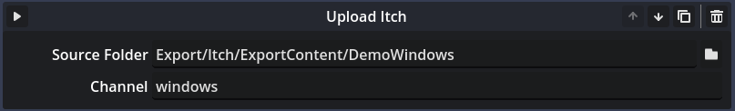

Uploads files to itch.io using butler. Before using it, fill the global and local configuration for Itch and make sure butler has cached credentials.

**Options**
- **Source Folder:** The folder containing your exported project files.
- **Channel:** Channel where the files will be uploaded. The name is semi-important, refer to [butler's manual](https://itch.io/docs/butler/pushing.html).

### Upload Steam

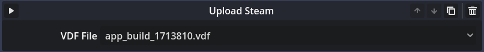

Uploads files to Steam using Steam CMD. Just like GOG, the whole setup is inside configuration file (but here it's VDF).

**Options**
- **VDF File:** The VDF file used for upload. Same as JSON in Upload GOG task.

## Closing Words

Project Builder evolved from build tools I created for Lumencraft. I wrote a small build system in Python, but eventually it got so many options that running from command line got annoying. From this experience I came up with a system where you can construct your various tasks from predefined building blocks, which are way easier to use.

If you have ideas for more useful tasks, feel free to suggest them in the Issues page.

___
You can find all my addons on my [profile page](https://github.com/KoBeWi).

<a href='https://ko-fi.com/W7W7AD4W4' target='_blank'></a>
